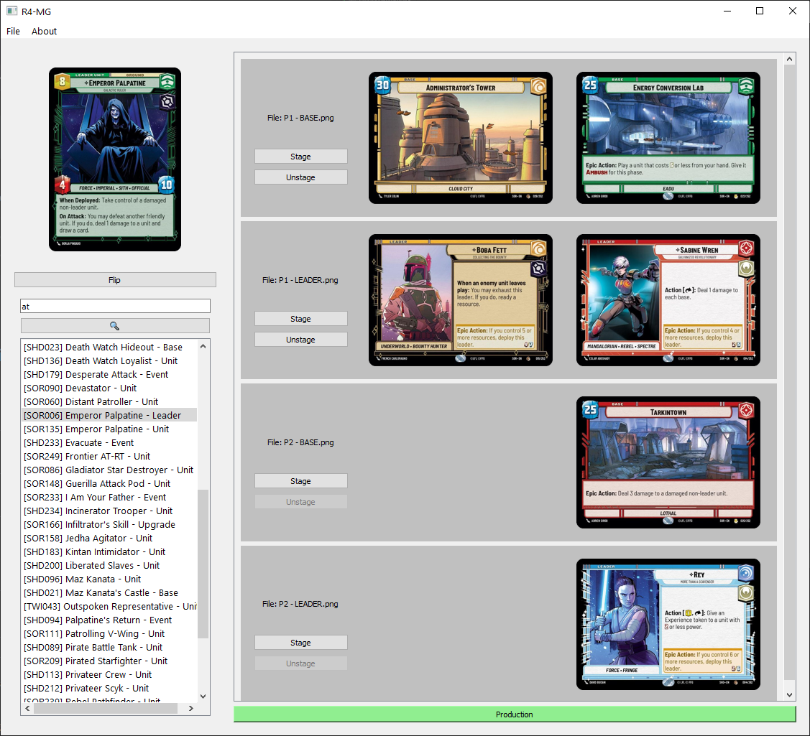
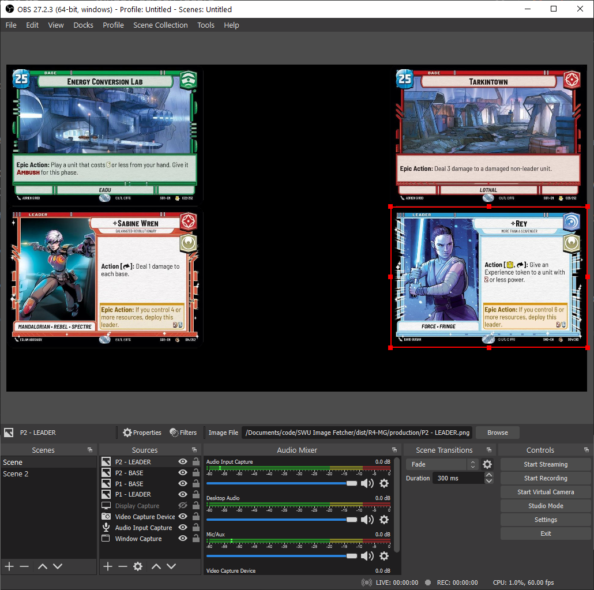

# R4-MG
Image asset loader for streaming the SWU TCG.

See [change log](./AppUI/Assets/Text/CHANGELOG.md) for feature updates.

## Installation
1. Download the [latest release build](https://github.com/hdchan/R4-MG/releases)
2. Extract `R4-MG`.
3. Open `R4-MG.exe`

## How to use

### Folders
Two folders will get generated during usage:
- cache - this stores all the cards you've previewed from your search.
- production - this stores the cards that you intend to use to show on your stream. OBS should make use of the files that are stored here.

### Dashboard

We can search for cards on the left side, and stage them to their respective files. Once ready, pressing on "Production" will copy the staged cards over to the `production` folder.

The list on the right hand side is populated with any `.png` files that are stored in the `production` folder. You can either drag your own `.png` file into the `production` folder and `File > Refresh` the list so it'll detect the newly added file, or add generate a new one to use in the `File > New` menu.

### Usage with OBS

We can source image files on our stream from the `production` folder, and they'll be updated simultaneously when sending staged cards to the `production` folder.

## Planned functionality
- [ ] Player group macro
- [ ] Macro for last played card
- [ ] Advanced filtered search
- [x] Recently published cards
- [x] Recent searches

## Attributions

- [SWU-DB.com](https://www.swu-db.com/api)
- [SWUDB.com](https://swudb.com/)
- [PyQt5](https://www.riverbankcomputing.com/static/Docs/PyQt5/)